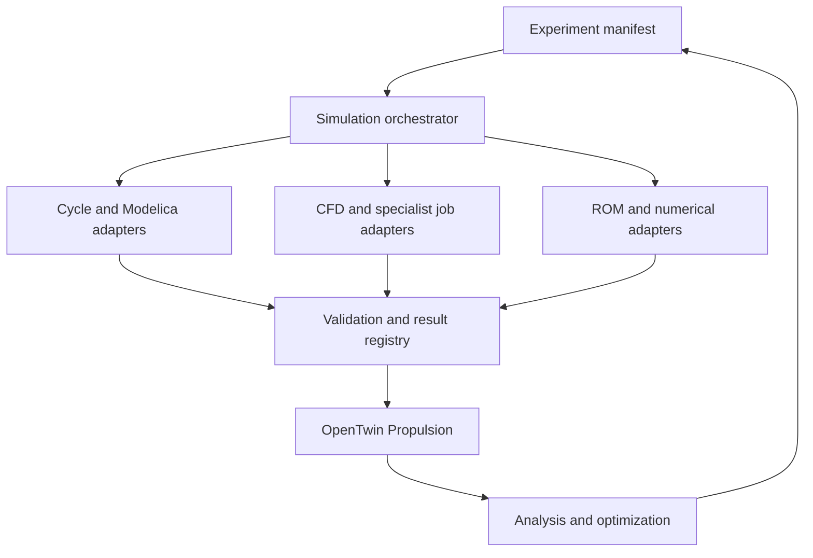

# jfxnpss

## Open Numerical Propulsion & Digital Twin Simulation Platform

**Expanded scope:** a categorized simulation ecosystem spanning numerical libraries, propulsion cycles, electrified systems, CFD/HPC, aerodynamics, neural PDEs, ROMs, aircraft optimization and specialist research. The catalog separates open execution candidates from external-runtime dependencies and unresolved references.

> An open-source engineering compendium and modular reference
> architecture for numerical propulsion system simulation,
> Modelica-based multiphysics, CFD, MDAO, AI-assisted reduced-order
> modeling, health monitoring, and interoperable propulsion digital
> twins.

**jfxnpss** is an open engineering and research project focused on
reusable methods and technologies for the modeling, simulation,
analysis, optimization, and digital-twin representation of propulsion
systems.

The project consolidates propulsion-system engineering around **MBSE,
CAD/CAM/CAS, thermodynamics, gas dynamics, turbomachinery, CFD,
Modelica, MDAO, reduced-order models, AI, electrified propulsion, and
modular digital-twin interfaces**.

The goal is not to reproduce a proprietary engine or commercial NPSS
implementation. Instead, jfxnpss provides a technology-neutral framework
for sufficiently abstract, modular, replaceable, and interoperable
propulsion models.

------------------------------------------------------------------------

## Table of Contents

-   [Project Vision](#project-vision)
-   [Description and Context](#description-and-context)
-   [Objectives](#objectives)
-   [Reference Architecture](#reference-architecture)
-   [Engineering Domains](#engineering-domains)
-   [OpenTwin Propulsion](#opentwin-propulsion)
-   [Modular Digital Twin Interfaces](#modular-digital-twin-interfaces)
-   [Digital Twin Interface Profiles](#digital-twin-interface-profiles)
-   [Digital Twin Data Model](#digital-twin-data-model)
-   [Modelica and Multiphysics
    Simulation](#modelica-and-multiphysics-simulation)
-   [CFD and Gas Dynamics](#cfd-and-gas-dynamics)
-   [AI, ROM and Physics-Informed
    Modeling](#ai-rom-and-physics-informed-modeling)
-   [MDAO and Optimization](#mdao-and-optimization)
-   [Open-Source Technology
    Compendium](#open-source-technology-compendium)
-   [Integration Profiles and Open Alternatives](#integration-profiles-and-open-alternatives)
-   [MBSE Engineering Process](#mbse-engineering-process)
-   [Modular Propulsion Concept](#modular-propulsion-concept)
-   [Repository Structure](#repository-structure)
-   [User Guide](#user-guide)
-   [Installation Guide](#installation-guide)
-   [Dependencies](#dependencies)
-   [Development Roadmap](#development-roadmap)
-   [How to Contribute](#how-to-contribute)
-   [Code of Conduct](#code-of-conduct)
-   [Authors and Maintainers](#authors-and-maintainers)
-   [Intellectual Property](#intellectual-property)
-   [Disclaimer](#disclaimer)
-   [License](#license)

------------------------------------------------------------------------

# Project Vision

jfxnpss explores an open propulsion-engineering stack based on:

**MBSE + Modelica + CFD + MDAO + Digital Twins + AI/ROM + Open
Interfaces**

The long-term objective is to enable propulsion-system research without
locking the architecture to one solver, engine topology, optimization
framework, AI model, data platform, cloud provider, or proprietary
digital-twin product.

Core principles:

1.  **Open architecture**
2.  **Modular physical models**
3.  **Interoperable digital twins**
4.  **Replaceable simulation engines**
5.  **Simulation-first engineering**
6.  **Reproducible research**
7.  **Multi-fidelity modeling**
8.  **Technology independence**

------------------------------------------------------------------------

# Description and Context

Propulsion engineering combines thermodynamics, fluid mechanics, heat
transfer, combustion, turbomachinery, controls, structures, materials,
acoustics, electrical systems, optimization, and increasingly
data-driven modeling.

jfxnpss organizes these disciplines into a modular research architecture
applicable to:

-   turbojet engines;
-   turbofan engines;
-   geared turbofans;
-   turboshaft and turboprop concepts;
-   micro gas turbines;
-   electric propulsion;
-   hybrid-electric propulsion;
-   hydrogen propulsion research;
-   distributed propulsion;
-   experimental propulsion systems;
-   high-speed and hypersonic flow research;
-   propulsion health monitoring;
-   virtual engine and digital-twin research.

------------------------------------------------------------------------

# Objectives

## Primary Objective

Develop a reusable open framework for numerical propulsion system
simulation and modular propulsion digital twins.

## Specific Objectives

-   Integrate MBSE with executable propulsion models.
-   Support Modelica-based multidomain simulation.
-   Integrate component, cycle, CFD, and reduced-order models.
-   Provide solver-independent digital-twin interfaces.
-   Support multi-fidelity model substitution.
-   Connect telemetry and experimental data to simulation.
-   Enable AI-assisted surrogate and reduced-order modeling.
-   Support MDAO and design optimization.
-   Investigate electrified and alternative-energy propulsion.
-   Support health monitoring and predictive-maintenance research.
-   Separate required dependencies from optional integrations and
    research references.

------------------------------------------------------------------------

# Reference Architecture

``` text
┌───────────────────────────────────────────────────────────┐
│                     APPLICATIONS                          │
│ Design │ Research │ Operations │ Energy │ Education      │
└────────────────────────────┬──────────────────────────────┘
                             │
┌────────────────────────────▼──────────────────────────────┐
│                  AI & OPTIMIZATION                        │
│ Surrogates │ ROM │ Anomaly Detection │ MDAO │ Prognosis  │
└────────────────────────────┬──────────────────────────────┘
                             │
┌────────────────────────────▼──────────────────────────────┐
│                OPENTWIN PROPULSION                        │
│ State │ Telemetry │ Models │ Health │ Synchronization    │
└────────────────────────────┬──────────────────────────────┘
                             │
┌────────────────────────────▼──────────────────────────────┐
│          MODULAR DIGITAL TWIN INTERFACE BUS               │
│ FMI │ SSP │ OPC UA │ MQTT │ DDS/ROS 2 │ REST │ Streams  │
└────────────────────────────┬──────────────────────────────┘
                             │
        ┌────────────────────┼─────────────────────┐
        ▼                    ▼                     ▼
     Modelica               CFD                 AI / ROM
        │                    │                     │
        └────────────────────┼─────────────────────┘
                             ▼
┌───────────────────────────────────────────────────────────┐
│                  MULTIPHYSICS CORE                        │
│ Thermal │ Fluid │ Combustion │ Turbomachinery │ Control  │
└────────────────────────────┬──────────────────────────────┘
                             │
┌────────────────────────────▼──────────────────────────────┐
│              MODULAR PROPULSION SYSTEM                    │
│ Inlet │ Fan │ Compressor │ Combustor │ Turbine │ Nozzle  │
│ Electric Machines │ Battery/Fuel/H2 │ Sensors │ Controls │
└───────────────────────────────────────────────────────────┘
```

------------------------------------------------------------------------

# Engineering Domains

  Domain           Purpose
  ---------------- ------------------------------------------------------
  Thermodynamics   Cycle and component performance
  Fluid Dynamics   Internal/external flow behavior
  CFD              High-fidelity flow simulation
  Combustion       Reacting-flow and combustor research
  Turbomachinery   Compressor, fan and turbine modeling
  Heat Transfer    Thermal loads and cooling
  Controls         Engine control and actuator behavior
  Electrical       Motors, generators and power electronics
  Energy           Fuel, battery and hydrogen systems
  Modelica         Multidomain equation-based simulation
  ROM              Reduced-order and surrogate representations
  AI               Prediction, anomaly detection and model acceleration
  MDAO             Multidisciplinary design and optimization
  Digital Twin     State synchronization and lifecycle analytics
  MBSE             Requirements, interfaces and architecture

------------------------------------------------------------------------

# OpenTwin Propulsion

**OpenTwin Propulsion** is the proposed generic digital-twin
architecture for jfxnpss.

It is intentionally independent of a specific engine vendor,
digital-twin product, solver, database, message broker, or cloud
platform.

``` text
PHYSICAL / EXPERIMENTAL SYSTEM
              │
              ▼
     Sensors / Test Data
              │
              ▼
     Acquisition Adapters
              │
              ▼
      Semantic Data Layer
              │
              ▼
   Digital Twin Interface Bus
      │       │       │
      ▼       ▼       ▼
 Modelica    CFD    AI / ROM
      │       │       │
      └───────┼───────┘
              ▼
      State Estimation
              │
      ┌───────┼────────┐
      ▼       ▼        ▼
 Simulation Health Optimization
      │       │        │
      └───────┼────────┘
              ▼
       Decision Support
```

The same architecture can operate with a real test rig, synthetic
telemetry, historical datasets, Hardware-in-the-Loop,
Software-in-the-Loop, or a completely virtual propulsion system.

------------------------------------------------------------------------

# Modular Digital Twin Interfaces

Digital-twin integration is designed as a set of **small replaceable
interfaces**, rather than a single monolithic API.

## 1. Physical Asset Adapter Interface

Connects sensors, test benches, embedded controllers, or synthetic
assets to the twin.

Responsibilities:

-   ingest measurements;
-   normalize timestamps;
-   expose asset identity;
-   report sensor quality;
-   translate hardware-specific protocols;
-   isolate hardware drivers from simulation models.

``` text
Physical Asset
     │
     ▼
Asset Adapter
     │
     ▼
Normalized Telemetry
```

------------------------------------------------------------------------

## 2. Telemetry Interface

Provides real-time or recorded propulsion data.

Example signals:

``` text
engine.speed
compressor.pressure_ratio
compressor.outlet_temperature
combustor.fuel_flow
turbine.inlet_temperature
turbine.exit_temperature
nozzle.pressure
thrust.estimated
motor.power
battery.soc
hydrogen.mass_flow
vibration.rms
```

Recommended characteristics:

-   timestamped samples;
-   explicit engineering units;
-   quality/status flags;
-   source metadata;
-   configurable sampling rate;
-   replay support.

Potential transports include MQTT, DDS, ROS 2, OPC UA, and
event-streaming systems.

------------------------------------------------------------------------

## 3. Model Interface

Provides a common abstraction around simulation models.

``` text
Model Interface
├── initialize()
├── configure(parameters)
├── set_inputs(values)
├── step(dt)
├── get_outputs()
├── get_state()
├── set_state()
├── reset()
└── shutdown()
```

The implementation may wrap:

-   Modelica models;
-   FMUs;
-   CFD solvers;
-   cycle models;
-   Python models;
-   neural surrogates;
-   reduced-order models;
-   external executables.

This makes the twin independent of the internal solver.

------------------------------------------------------------------------

## 4. FMI / FMU Interface

The **Functional Mock-up Interface (FMI)** can be used as a portable
model boundary.

``` text
Modelica / Other Tool
         │
         ▼
        FMU
         │
         ▼
   Twin Model Adapter
         │
         ▼
OpenTwin Propulsion
```

Potential uses:

-   Model Exchange;
-   Co-Simulation;
-   Scheduled Execution where supported;
-   packaging replaceable component models;
-   exchanging models between simulation environments.

------------------------------------------------------------------------

## 5. System Structure Interface

Complex propulsion twins require more than individual models. A system
description should define:

-   model instances;
-   connections;
-   parameter sets;
-   signal mappings;
-   initialization;
-   variants;
-   experiment configuration.

An SSP-style system packaging approach can be used where appropriate.

``` text
Twin Configuration
├── Fan.fmu
├── Compressor.fmu
├── Combustor.fmu
├── Turbine.fmu
├── Controller.fmu
├── Connections
└── Parameters
```

------------------------------------------------------------------------

## 6. State Interface

The state interface separates **observed**, **estimated**, and
**simulated** states.

``` text
Twin State
├── Observed State
├── Estimated State
├── Simulated State
├── Health State
└── Configuration State
```

A state record should include:

``` yaml
asset_id: propulsion-unit-001
timestamp: 2026-01-01T00:00:00Z
mode: simulation
state:
  shaft_speed_rpm: 0
  thrust_n: 0
  health_index: 1.0
quality:
  status: valid
```

The values above are illustrative only.

------------------------------------------------------------------------

## 7. Parameter Interface

Separates calibration and configuration from model source code.

Typical parameter groups:

-   geometry;
-   compressor maps;
-   turbine maps;
-   efficiencies;
-   thermal properties;
-   controller gains;
-   degradation coefficients;
-   environmental conditions.

``` text
Parameter Service
      │
      ├── Baseline
      ├── Calibration
      ├── Variant
      └── Experiment
```

------------------------------------------------------------------------

## 8. Command and Control Interface

Provides controlled interaction with simulation and experimental
environments.

Possible commands:

-   start;
-   stop;
-   pause;
-   reset;
-   change operating point;
-   load scenario;
-   apply disturbance;
-   switch model fidelity.

For real propulsion hardware, command interfaces must be isolated from
research analytics and protected by appropriate independent safety
systems.

------------------------------------------------------------------------

## 9. Health Monitoring Interface

Standardizes outputs from diagnostics and prognostics modules.

``` text
Health Interface
├── anomaly_score
├── health_index
├── fault_code
├── confidence
├── remaining_useful_life
└── recommended_action
```

Potential applications include:

-   compressor degradation;
-   turbine deterioration;
-   bearing anomalies;
-   thermal anomalies;
-   sensor faults;
-   electric-machine health.

------------------------------------------------------------------------

## 10. AI / ROM Interface

Allows a physics model to be replaced or augmented by a data-driven
model.

``` text
High-Fidelity Model
        │
        ▼
Training / Reduction
        │
        ▼
AI / ROM Adapter
        │
        ▼
Standard Model Interface
```

Every AI/ROM implementation should document:

-   training-data provenance;
-   input/output ranges;
-   physical constraints;
-   uncertainty;
-   validation metrics;
-   extrapolation limitations.

------------------------------------------------------------------------

## 11. CFD Interface

High-fidelity CFD should remain loosely coupled.

``` text
Twin
 │
 ▼
CFD Adapter
 │
 ├── Geometry
 ├── Boundary Conditions
 ├── Solver Configuration
 ├── Execution
 └── Results Extraction
```

This enables different CFD technologies to be evaluated without changing
the twin architecture.

------------------------------------------------------------------------

## 12. Optimization Interface

Provides a generic boundary for design and operational optimization.

``` text
Optimization Problem
├── Design Variables
├── Objectives
├── Constraints
├── Model Evaluator
└── Results
```

It may connect OpenMDAO or other optimization frameworks to Modelica,
CFD, cycle models, or AI surrogates.

------------------------------------------------------------------------

## 13. Data Storage Interface

Storage is separated from the digital-twin core.

Logical data categories:

``` text
Twin Data
├── Telemetry
├── Events
├── Parameters
├── Simulation Results
├── Health History
├── Model Versions
└── Experiment Metadata
```

Adapters may target time-series databases, relational databases, object
storage, or local research files.

------------------------------------------------------------------------

## 14. Visualization Interface

Dashboards and 3D visualization consume standardized twin data rather
than accessing solvers directly.

Potential clients:

-   Grafana;
-   Jupyter;
-   engineering dashboards;
-   web applications;
-   3D visualization;
-   AR/VR research interfaces.

``` text
Models / Assets
      │
      ▼
Twin API
      │
 ┌────┼────────┐
 ▼    ▼        ▼
Web  Grafana  3D/AR
```

------------------------------------------------------------------------

## 15. Lifecycle and Model Registry Interface

Each digital-twin model should be identifiable and reproducible.

Recommended metadata:

``` yaml
model:
  id: compressor-rom
  version: 0.1.0
  type: reduced-order-model
  fidelity: medium
  interface: twin-model-v1
  license: project-specific
  validation_status: experimental
```

A model registry can manage:

-   versions;
-   compatibility;
-   fidelity;
-   provenance;
-   validation status;
-   licenses;
-   replacement models.

------------------------------------------------------------------------

# Digital Twin Interface Profiles

Instead of requiring every deployment to implement every interface,
jfxnpss defines conceptual profiles.

## Minimal Simulation Twin

``` text
Model Interface
+ Parameter Interface
+ State Interface
```

Suitable for purely virtual experiments.

## Connected Twin

``` text
Minimal Simulation Twin
+ Telemetry Interface
+ Asset Adapter
+ Data Storage Interface
```

Suitable for test rigs and experimental systems.

## Intelligent Twin

``` text
Connected Twin
+ AI / ROM Interface
+ Health Interface
+ Optimization Interface
```

Suitable for analytics and predictive-maintenance research.

## Multi-Fidelity Engineering Twin

``` text
Intelligent Twin
+ FMI
+ CFD Interface
+ MDAO Interface
+ Model Registry
```

Suitable for engineering design and simulation orchestration.

------------------------------------------------------------------------

# Digital Twin Data Model

A technology-neutral canonical model prevents every tool from defining
incompatible names.

``` text
PropulsionTwin
│
├── Identity
│   ├── asset_id
│   ├── model_id
│   └── configuration_id
│
├── Environment
│   ├── altitude
│   ├── mach
│   ├── temperature
│   └── pressure
│
├── OperatingPoint
│   ├── throttle
│   ├── shaft_speed
│   └── mass_flow
│
├── Components
│   ├── inlet
│   ├── fan
│   ├── compressor
│   ├── combustor
│   ├── turbine
│   └── nozzle
│
├── Energy
│   ├── fuel
│   ├── electrical
│   └── hydrogen
│
├── Performance
│   ├── thrust
│   ├── efficiency
│   └── consumption
│
└── Health
    ├── diagnostics
    ├── degradation
    └── prognosis
```

All quantities should explicitly define units and coordinate/reference
conventions.

------------------------------------------------------------------------

# Modelica and Multiphysics Simulation

Modelica can provide the equation-based physical-modeling layer.

``` text
Propulsion System
├── Fluid
│   ├── Inlet
│   ├── Compressor
│   ├── Combustor
│   ├── Turbine
│   └── Nozzle
├── Mechanical
│   ├── Shafts
│   └── Bearings
├── Thermal
│   ├── Heat Transfer
│   └── Cooling
├── Electrical
│   ├── Motor
│   ├── Generator
│   └── Power Electronics
├── Energy
│   ├── Fuel
│   ├── Battery
│   └── Hydrogen
└── Control
    ├── Sensors
    ├── Actuators
    └── Controller
```

Modelica models should connect to the digital-twin architecture through
adapters rather than exposing implementation-specific internals.

------------------------------------------------------------------------

# CFD and Gas Dynamics

jfxnpss treats CFD as one fidelity level in a broader simulation
hierarchy.

``` text
0D / Cycle
    │
    ▼
1D Network
    │
    ▼
Reduced Order
    │
    ▼
2D / 3D CFD
    │
    ▼
Experimental Validation
```

Research references include SU2, Nek5000-family approaches,
OpenFOAM-related workflows, GDTk, hyStrath, dsmcFoam+ and other open
gas-dynamics resources represented by the project compendium.

Potential domains:

-   compressor and turbine flow;
-   nozzle flow;
-   intake aerodynamics;
-   combustion;
-   heat transfer;
-   high-speed flow;
-   rarefied gas dynamics.

------------------------------------------------------------------------

# AI, ROM and Physics-Informed Modeling

AI should complement, not obscure, physical modeling.

Potential research areas:

-   neural surrogate models;
-   reduced-order PDE models;
-   physics-informed learning;
-   anomaly detection;
-   parameter estimation;
-   sensor reconstruction;
-   model discrepancy correction;
-   simulation acceleration.

``` text
Physics Model ───────┐
                     │
Experimental Data ───┼──► Hybrid Model ─► Twin
                     │
AI / ROM ────────────┘
```

The repository should preserve traceability between high-fidelity models
and reduced representations.

------------------------------------------------------------------------

# MDAO and Optimization

MDAO connects multiple propulsion disciplines.

``` text
Design Variables
      │
      ▼
Thermodynamic Cycle
      │
 ┌────┼─────┐
 ▼    ▼     ▼
CFD Thermal Weight
 │    │     │
 └────┼─────┘
      ▼
 Performance
      │
      ▼
 Optimizer
      │
      └────► New Design
```

Potential objectives include efficiency, thrust, mass, thermal limits,
fuel/energy consumption, emissions-related research metrics, and
operating cost proxies.

------------------------------------------------------------------------

# Open-Source Technology Compendium

This categorized catalog consolidates the requested alternatives into the existing **OpenTwin Propulsion** architecture. Entries are candidates or research references, not installed dependencies or working integrations. Source documentation was reviewed on 2026-09-19; exact revisions, transitive dependencies and executable compatibility must be recorded before adoption.

**Classification:** **OPEN CANDIDATE** = candidate for an open execution profile; **SPECIALIST** = optional domain-specific tool; **EXTERNAL RUNTIME** = published source/model requiring a separate platform; **RESEARCH** = exploratory reference; **UNRESOLVED** = identity or licensing still needs confirmation. These labels describe proposed integration roles, not a legal license audit.

## 1. Scientific Computing and Numerical Foundations

| Resource | Capability and proposed role | Classification and boundary |
|---|---|---|
| [Raven](https://github.com/raven-ml/raven) | OCaml ecosystem for arrays, differentiation, neural networks, dataframes and experiment workflows; optional typed numerical/AI service | **OPEN CANDIDATE / experimental**. README declares ISC and alpha status. Keep behind a process/API boundary; no assumption of direct Python or FMI compatibility. |
| [Apache Mahout](https://mahout.apache.org/) | Scalable ML ecosystem; the requested distributed-linear-algebra role belongs to its historical numerical stack | **SPECIALIST**. The current project site emphasizes Qumat. Pin the specific historical module/release if evaluating distributed linear algebra; do not equate Qumat with a CFD solver or silently substitute it. |
| Ptolemaeus | Requested Java mathematics library; potential JVM numerical adapter | **UNRESOLVED**. A matching authoritative Java library was not established. Preserve the entry without inventing a repository, license or API. Do not confuse it with Ptolemy II or similarly named projects. |
| [Ascent](https://github.com/AnyarInc/Ascent) | C++ differential-equation integration and modular simulation; candidate for lightweight ODE components | **OPEN CANDIDATE**. README describes Apache licensing and C++17. Benchmark the selected integrator; do not repeat comparative speed claims as jfxnpss results. |

## 2. Aeronautical Geometry, Performance and Reference Programs

| Resource | Capability and proposed role | Classification and boundary |
|---|---|---|
| [Public Domain Aeronautical Software — PDAS](https://www.pdas.com/) | Collection of aeronautical analysis programs; reference methods and selected comparison cases | **SPECIALIST / reference collection**. Assess documentation, provenance, compiler needs and distribution conditions program by program; this is not a unified solver API. |
| [OpenVSP](https://github.com/OpenVSP/OpenVSP) | Parametric aircraft geometry; geometry generation and analysis-input preparation | **OPEN CANDIDATE**. README identifies NOSA 1.3. Geometry export does not automatically supply a CFD-quality mesh or validated aircraft model. |
| [OpenAP](https://github.com/junzis/openap) | Aircraft performance, fuel use and emissions modeling for air-transport studies | **OPEN CANDIDATE**. README identifies LGPL v3. Convert its documented mixed units at the adapter boundary; optional BADA access is separate from the open-data profile. |

## 3. Propulsion Cycles, Thermofluids and Electrified Systems

| Resource | Capability and proposed role | Classification and boundary |
|---|---|---|
| [pyCycle](https://github.com/OpenMDAO/pyCycle) | Thermodynamic cycle modeling on OpenMDAO, primarily jet-engine performance; default cycle-model candidate | **OPEN CANDIDATE**. Python package is `om-pycycle`, imported as `pycycle`. Pin compatible OpenMDAO versions and thermodynamic data; do not assume default fuel tables cover hydrogen. |
| [PropulsionSystem](https://github.com/zeta-plusplus/PropulsionSystem) | Modelica thermo-fluid and thermodynamic component library for aircraft propulsion and related systems | **OPEN CANDIDATE**. This matches the unnamed library description supplied in the request. README declares GPL v3 and dependencies including FluidSystemComponents, InteractiveSimulation and Modelica_DeviceDrivers. Test selected examples with the chosen OpenModelica release. |
| [OpenModelica](https://openmodelica.org/) / Modelica libraries | Equation-based thermal, fluid, mechanical, electrical and control models | **OPEN CANDIDATE**, retained from the existing backbone. Select libraries independently; use FMI only where export/import capabilities have been demonstrated. |
| [NPSS Power System Library — PSL](https://github.com/nasa/NPSS-Power-System-Library) | Electrical components, machines, ports and buses that connect to NPSS propulsion models | **EXTERNAL RUNTIME**. Requires an NPSS environment. Public library source does not establish an open NPSS runtime; keep outside the default open execution profile. |
| [T-MATS](https://github.com/nasa/T-MATS) | Toolbox for modeling and analysis of thermodynamic systems, including gas-turbine models and controls | **EXTERNAL RUNTIME**. Source is published, but its MATLAB/Simulink environment is a separate dependency. Use as a comparison/reference profile rather than claim a fully open runtime. |
| [AGTF30-e](https://github.com/nasa/AGTF30-e) | Advanced Geared Turbofan 30,000 lbf Electrified research model; conventional, electric boost and power-extraction studies | **EXTERNAL RUNTIME / research model**. Uses MATLAB/Simulink and T-MATS. It is a model, not a generic solver or demonstrated physical engine. Preserve the bundled dependency compatibility. |

The open alternative to the external-runtime profile is a **new, independently validated model** using pyCycle/OpenMDAO for cycle analysis and OpenModelica for transient multidomain behavior. This is not an automatic conversion of NPSS, PSL, T-MATS or AGTF30-e.

## 4. Continuum CFD, Turbulence and GPU Computing

| Resource | Capability and proposed role | Classification and boundary |
|---|---|---|
| [SU2](https://su2code.github.io/) | CFD, multiphysics and PDE-constrained design optimization; reusable high-fidelity adapter | **OPEN CANDIDATE**. Official site identifies LGPL 2.1. Choose the governing equations and solver configuration for each case. |
| [URANOS](https://github.com/sdk2035/uranos-gpu) | GPU-accelerated compressible Navier–Stokes solver; optional turbulence/aerothermodynamics studies | **SPECIALIST**. Reviewed fork documents CPU/GPU execution, OpenACC and MPI, and links [upstream](https://github.com/uranos-gpu/uranos-gpu). Track both origins; compiler/GPU requirements are profile-specific. |
| [Nek5000](https://github.com/Nek5000/Nek5000) | Scalable CFD and high-order turbulence-analysis workflows | **SPECIALIST**. Evaluate relevant examples and governing-equation support. Do not assume Nek5000 and other Nek-family projects have identical APIs or accelerator support. |
| OpenFOAM ecosystem | Existing alternative for selected continuum CFD and heat-transfer workflows | **OPEN CANDIDATE**, retained from the source architecture. Record the exact distribution, release and solver; similarly named branches are not interchangeable. |

CFD jobs should execute through a batch-job adapter with mesh, boundary-condition, solver and result manifests. GPU availability alone does not establish speed, accuracy or real-time digital-twin suitability.

## 5. High-Speed and Rarefied Gas Dynamics

| Resource | Capability and proposed role | Classification and boundary |
|---|---|---|
| [Gas Dynamics Toolkit — GDTk](https://gdtk.uqcloud.net/) | Gas-dynamics tools spanning small calculations and high-performance flow simulation | **SPECIALIST**. Select the actual program, gas model and validation case; the toolkit is not one uniform execution interface. |
| [hyStrath](https://github.com/hystrath/hyStrath) | Framework of hypersonic/rarefied gas-dynamics developments, including CFD and particle methods | **SPECIALIST**. README declares GPL-3.0. Select a compatible OpenFOAM environment and verify each solver separately. |
| [dsmcFoam+](https://github.com/hystrath/hyStrath) | OpenFOAM-based direct simulation Monte Carlo solver included in hyStrath | **SPECIALIST**. Keep a distinct catalog entry but record the shared provenance; DSMC statistical uncertainty and rarefaction validity differ from continuum CFD. |

These are optional scientific-flow profiles. Select continuum or particle descriptions from the physical regime and available validation data, rather than treating every solver as an interchangeable engine model.

## 6. Aerodynamics, Wakes and Aeroacoustics

| Resource | Capability and proposed role | Classification and boundary |
|---|---|---|
| [NeuralFoil](https://github.com/peterdsharpe/NeuralFoil) | Fast airfoil analysis combining learned and analytical modeling; low-cost aerodynamic surrogate | **OPEN CANDIDATE**. README identifies MIT. Retain confidence output and applicability limits; a two-dimensional airfoil prediction is not a complete three-dimensional aircraft or propulsor solution. |
| [FLOWUnsteady](https://github.com/byuflowlab/FLOWUnsteady) | Variable-fidelity unsteady aerodynamics and aeroacoustics using the reformulated vortex particle method (rVPM) | **SPECIALIST**. Candidate for wake/rotor/wing interaction studies; document actuator models, acoustics dependencies and chosen fidelity. It is not a general reacting internal-flow replacement. |

OpenVSP geometry, NeuralFoil airfoil outputs, FLOWUnsteady wake studies and SU2 CFD may contribute to a common study, but the conversion, meshing and coupling adapters are proposed work.

## 7. Neural PDEs, Reactive Flows and Reduced-Order Models

| Resource or topic | Capability and proposed role | Classification and boundary |
|---|---|---|
| [Neural-PDEs](https://github.com/sdk2035/Neural-PDEs) | Neural-network approximation of PDE solutions | **RESEARCH**. The reviewed README is minimal. Inspect equations, examples, license and dependencies before selecting an implementation; do not conflate it with similarly named packages. |
| [ModelFLOWs-combustion](https://github.com/sdk2035/ModelFLOWs-combustion) | Candidate associated with the supplied reactive-flow/ROM description | **RESEARCH / capability verification pending**. The reviewed README contains only the title; it does not substantiate an executable CFD/ROM pipeline. |
| Complex reactive flows, mixing and thermal dynamics through CFD and ROMs | Cross-cutting workflow: generate physical snapshots, reduce the state, evaluate a surrogate, compare against withheld physical cases | **RESEARCH WORKFLOW**, not a standalone package name. Specify chemistry, transport and boundary assumptions for every reference dataset. |

A neural approximation may be a direct PDE solution ansatz, an operator surrogate or a reduced model. Record which one is used. Validation should include conservation residuals, boundary-condition consistency, prediction errors, uncertainty and out-of-domain detection; training loss alone is insufficient.

## 8. Aircraft Design and System Architecture Optimization

| Resource | Capability and proposed role | Classification and boundary |
|---|---|---|
| [OpenMDAO](https://github.com/OpenMDAO/OpenMDAO) | Multidisciplinary analysis and optimization orchestration | **OPEN CANDIDATE**, retained as the optimization boundary. Match derivative support and optimizer dependencies to the selected profile. |
| [Aviary](https://github.com/OpenMDAO/Aviary) | Aircraft analysis, sizing, mission analysis and optimization built on OpenMDAO | **OPEN CANDIDATE**. Couple mission demands to a propulsion model through explicit units and validity limits. Optional optimizer choices may introduce separate licensing requirements. |
| OTA — system architecture optimization | Requested architecture-level exploration resource | **UNRESOLVED**. The acronym and description did not identify a unique authoritative project. Keep as a catalog placeholder, not an installed dependency or an alias for OpenMDAO. |

## 9. Discrete Numerical Models

| Resource | Capability and proposed role | Classification and boundary |
|---|---|---|
| [Yade](https://yade-dem.org/doc/) | Extensible discrete-element framework with C++ computation and Python scene/control workflows | **SPECIALIST**. Appropriate for selected granular/contact research. DEM and DSMC represent different physical/numerical methods; do not use the names interchangeably. |

## 10. Space Power and Thermal-System Research

| Resource | Capability and proposed role | Classification and boundary |
|---|---|---|
| [Space Reactor Computational Modeling](https://github.com/sdk2035/sCO2_reactor) | Reviewed README describes surrogate scripts connecting a space-reactor study to power-cycle/system-mass calculations | **RESEARCH REFERENCE ONLY**. Catalog provenance and external power-cycle/thermal interfaces; not a general reactor simulator, validated nuclear design model or core propulsion dependency. License and scope need separate review. |

This optional category remains separate from the initial MVP. Its inclusion records the requested research reference; this README provides no reactor construction, fuel specification or operating design.

## Source and Identity Follow-up

| Item | Remaining work before adoption |
|---|---|
| Ptolemaeus | Supply or confirm the exact Java project URL, maintainer and license. |
| OTA | Supply or confirm the exact architecture-optimization repository and scope. |
| Neural-PDEs | Inspect implementation, license and reproducible examples beyond the minimal README. |
| ModelFLOWs-combustion | Confirm that code and documentation support the requested reactive-flow, mixing, thermal and ROM capabilities. |
| All candidates | Pin commit/release, license file, dependency versions and benchmark evidence. |

The links above are discovery/provenance references, not evidence that jfxnpss has installed, tested or integrated every resource.

------------------------------------------------------------------------

# Integration Profiles and Open Alternatives

| Profile | Proposed components | What it should demonstrate |
|---|---|---|
| Open cycle baseline | pyCycle + OpenMDAO | Reproducible cycle evaluation with explicit thermodynamic data |
| Open transient multiphysics | OpenModelica + selected PropulsionSystem components | Thermal/electrical/mechanical coupling with documented initialization |
| Aircraft and mission context | OpenVSP + Aviary; OpenAP as a separate performance reference | Traceable geometry, mission demand and propulsion inputs |
| External aerodynamics | NeuralFoil + FLOWUnsteady or SU2 as appropriate | Different fidelity levels compared within their valid regimes |
| CFD/HPC | Selected SU2, URANOS, Nek5000 or OpenFOAM case | Mesh/time-step study, hardware record and reproducible outputs |
| Rarefied-flow research | Selected GDTk/hyStrath/dsmcFoam+ capability | Appropriate regime, reference case and uncertainty reporting |
| AI/ROM research | Verified Neural-PDEs implementation or an independently selected ML backend; optional Raven | Traceable training data and held-out physical validation |
| External-runtime comparison | PSL/NPSS or T-MATS/AGTF30-e | Licensed execution environment and comparison against open models |
| Discrete models | Yade | A standalone validated DEM example before any coupling |
| Specialized space-power reference | Reviewed literature/model metadata only | Clear separation from the core MVP and nuclear design work |

No profile requires installing the entire catalog. Candidate tools are selected for a concrete physical question and reproducible experiment.

## Proposed Adapter Architecture



**Cycle adapters** expose operating-point evaluation and convergence status. **Transient adapters** expose initialization, time advancement and event handling only where supported. **CFD adapters** submit asynchronous jobs rather than pretending to implement a real-time `step(dt)`. **ROM adapters** declare their training domain and a fallback when inputs leave it.

FMI/SSP are potential interchange boundaries, not native capabilities assumed for every library. A C++, Fortran, Java, OCaml, Python or Julia implementation may instead use a command-line runner or service adapter. Keep proprietary-runtime adapters in separate optional environments.

## Canonical Exchange and Reproducibility

Every experiment should record:

- resource URL, pinned commit/release and license evidence;
- solver/model identity, dependency lock information and execution environment;
- geometry/mesh IDs, property tables and dataset provenance;
- input/output names, SI units, reference frames and time conventions;
- convergence status, residuals and numerical tolerances;
- supported regime, fidelity and validation status;
- CPU/GPU/MPI configuration, elapsed time and peak memory where measured;
- result checksums and observed/estimated/simulated state distinctions.

Exchange boundaries must distinguish static from total thermodynamic quantities, molar from mass-based composition, and shaft from electrical power. Conservation and unit checks should occur at every coupling boundary. A solver failure must remain a failed result, not a plausible-looking twin state.

## CFD-to-ROM Workflow

1. Define a bounded physical problem and reference case.
2. Generate converged, versioned snapshots with a suitable physical solver.
3. Split datasets by operating condition to reduce train/test leakage.
4. Train or reduce the model and document its representation.
5. Compare withheld predictions and physical residuals against declared tolerances.
6. Publish the model and its validity envelope to the registry.
7. Route out-of-domain requests to a supported physical model or report them as unsupported.

Reactive-flow datasets require explicit thermochemistry and transport assumptions. This workflow does not establish ModelFLOWs-combustion or Neural-PDEs as production-ready implementations.

## Implementation Sequence

| Stage | Concrete deliverable | Acceptance evidence |
|---|---|---|
| Catalog | Resolve uncertain identities; create per-resource manifests | All adopted resources have URLs, pinned versions and license records |
| Baseline | One pyCycle example wrapped by the Model Interface | Reproduced reference output, units and convergence recorded |
| Multiphysics | One OpenModelica example with selected components | Reproducible initialization and thermal/power balance |
| CFD | One batch-run solver adapter and benchmark | Grid/time-step evidence and explicit failure handling |
| ROM | One bounded surrogate linked to its source dataset | Held-out error, conservation checks and domain limits |
| Twin | Replay results into OpenTwin state and visualization | Provenance and simulated/observed state remain distinguishable |
| Optimization | One OpenMDAO/Aviary study using validated adapters | Constraints, derivative strategy and evaluation failures recorded |

These deliverables extend the existing roadmap. They are proposed implementation work, not components created by this documentation update.

------------------------------------------------------------------------

# MBSE Engineering Process

``` text
Requirements
     │
     ▼
Operational Analysis
     │
     ▼
System Architecture
     │
     ▼
Logical Architecture
     │
     ▼
Physical Architecture
     │
 ┌───┼────────────┐
 ▼   ▼            ▼
CAD CAM           CAS
 │   │             │
 └───┴──────┬──────┘
            ▼
     OpenTwin Propulsion
            │
            ▼
      AI / Optimization
```

MBSE should define interfaces before selecting implementations.

------------------------------------------------------------------------

# Modular Propulsion Concept

``` text
PROPULSION PLATFORM
│
├── Inlet
├── Fan
├── Compressor
├── Combustor
├── Turbine
├── Nozzle
├── Shafts
├── Sensors
├── Control
└── Energy Interface
        │
        ▼
OPTIONAL / REPLACEABLE MODULES
│
├── Electric Motor
├── Generator
├── Battery
├── Hydrogen System
├── Alternative Combustor
├── ROM / AI Model
└── High-Fidelity CFD Model
```

A module can have several fidelity implementations while preserving the
same external contract.

``` text
Compressor Interface
├── Map Model
├── Modelica Model
├── FMU
├── ROM
└── CFD Model
```

------------------------------------------------------------------------

# Repository Structure

Recommended evolution:

``` text
jfxnpss/
├── README.md
├── LICENSE
├── CONTRIBUTING.md
├── CODE_OF_CONDUCT.md
├── MBSE/
│   ├── requirements/
│   ├── logical-architecture/
│   └── physical-architecture/
├── models/
│   ├── modelica/
│   ├── cycle/
│   ├── rom/
│   └── ai/
├── cfd/
│   ├── cases/
│   ├── adapters/
│   └── validation/
├── digital-twin/
│   ├── core/
│   ├── state/
│   ├── synchronization/
│   ├── health/
│   └── registry/
├── interfaces/
│   ├── asset/
│   ├── telemetry/
│   ├── model/
│   ├── fmi/
│   ├── opcua/
│   ├── mqtt/
│   ├── dds/
│   ├── rest/
│   ├── storage/
│   └── visualization/
├── optimization/
│   ├── mdao/
│   └── calibration/
├── simulation/
│   ├── scenarios/
│   ├── sil/
│   ├── hil/
│   └── benchmarks/
├── schemas/
│   ├── telemetry/
│   ├── state/
│   ├── parameters/
│   └── health/
└── docs/
    ├── architecture/
    ├── interfaces/
    ├── references/
    └── images/
```

------------------------------------------------------------------------

# User Guide

A typical research workflow is:

1.  Define the propulsion use case.
2.  Capture requirements using MBSE.
3.  Select the required fidelity.
4.  Define propulsion components and interfaces.
5.  Create or select physical models.
6.  Wrap models using the standard model interface.
7.  Configure parameters and operating conditions.
8.  Connect telemetry or synthetic data if required.
9.  Run simulations.
10. Synchronize the digital-twin state.
11. Apply AI/ROM or optimization where appropriate.
12. Compare predictions with reference or experimental data.
13. Record model version and validation status.

------------------------------------------------------------------------

# Installation Guide

jfxnpss is a compendium and reference architecture, not a mandatory
monolithic software distribution.

``` bash
git clone https://github.com/robotics-intelligent-systems/jfxnpss.git
cd jfxnpss
```

A conceptual environment may include:

``` text
MBSE               -> Capella
Physical Modeling  -> OpenModelica
Cycle Analysis     -> pyCycle
MDAO               -> OpenMDAO
CFD                -> SU2 / selected open solver
AI / ROM           -> Python ecosystem
Twin Messaging     -> MQTT / DDS / ROS 2
Industrial Data    -> OPC UA
Model Exchange     -> FMI / FMU
Visualization      -> Grafana / Jupyter
Containers         -> Docker
```

Exact versions and installation procedures should be documented by each
executable module.

------------------------------------------------------------------------

# Dependencies

jfxnpss distinguishes three categories.

### Required Dependencies

Software strictly required by an executable module.

### Optional Integrations

Interchangeable tools providing additional simulation, communication,
storage, optimization, or visualization capabilities.

### Research References

External technologies used only for comparative analysis, architecture
research, or evaluation.

Each integration should document:

-   project and version;
-   role;
-   license;
-   interface used;
-   required/optional status;
-   validation status.

------------------------------------------------------------------------

# Development Roadmap

## Phase 1 --- Compendium Refactoring

-   [x] Organize propulsion research technologies.
-   [x] Define MBSE/CAD/CAM/CAS context.
-   [x] Separate reference technologies conceptually.
-   [x] Expand and categorize the requested simulation compendium.
-   [ ] Resolve Ptolemaeus and OTA project identities.
-   [ ] Normalize catalog metadata and pin source revisions.
-   [ ] Record licenses and maturity.

## Phase 2 --- Modular Propulsion Architecture

-   [ ] Define canonical component interfaces.
-   [ ] Define common engineering units.
-   [ ] Define parameter schemas.
-   [ ] Define model-fidelity metadata.

## Phase 3 --- OpenTwin Propulsion MVP

-   [ ] Implement Twin Core.
-   [ ] Implement State Interface.
-   [ ] Implement Telemetry Interface.
-   [ ] Implement Model Adapter API.
-   [ ] Implement parameter/configuration service.
-   [ ] Add synthetic telemetry demonstration.

## Phase 4 --- Modelica / FMI

-   [ ] Create simplified propulsion Modelica model.
-   [ ] Export/import FMU.
-   [ ] Implement FMI adapter.
-   [ ] Demonstrate component replacement.
-   [ ] Add co-simulation example.

## Phase 5 --- Connected Digital Twin

-   [ ] MQTT adapter.
-   [ ] OPC UA adapter.
-   [ ] DDS/ROS 2 adapter.
-   [ ] Time-series storage adapter.
-   [ ] Grafana/Jupyter visualization.

## Phase 6 --- Multi-Fidelity Simulation

-   [ ] Cycle model adapter.
-   [ ] CFD adapter.
-   [ ] ROM adapter.
-   [ ] Model fidelity switching.
-   [ ] Validation benchmark.

## Phase 7 --- AI and Health

-   [ ] Anomaly detection.
-   [ ] Parameter estimation.
-   [ ] Degradation model.
-   [ ] Health-index interface.
-   [ ] Predictive-maintenance experiment.

## Phase 8 --- MDAO and Sustainable Propulsion

-   [ ] OpenMDAO integration.
-   [ ] Electric propulsion study.
-   [ ] Hybrid-electric study.
-   [ ] Hydrogen-energy study.
-   [ ] Multi-objective optimization experiment.

------------------------------------------------------------------------

# How to Contribute

Contributions are welcome in:

-   Modelica models;
-   propulsion-cycle models;
-   CFD;
-   gas dynamics;
-   turbomachinery;
-   thermal simulation;
-   MDAO;
-   AI/ROM;
-   digital-twin interfaces;
-   FMI adapters;
-   OPC UA/MQTT/DDS integrations;
-   schemas;
-   validation cases;
-   documentation.

Suggested workflow:

``` bash
git checkout -b feature/my-contribution
git add .
git commit -m "Add: description of contribution"
git push origin feature/my-contribution
```

Pull requests should describe:

1.  the problem;
2.  the proposed solution;
3.  interface compatibility;
4.  dependencies;
5.  licenses;
6.  validation method;
7.  simulation or test results.

------------------------------------------------------------------------

# Code of Conduct

Contributors are expected to maintain a professional, inclusive, and
collaborative environment.

A dedicated `CODE_OF_CONDUCT.md` should be maintained in the repository
root.

------------------------------------------------------------------------

# Authors and Maintainers

Maintained by the **Robotics Intelligent Systems** open-source
initiative.

Project repository:

`robotics-intelligent-systems/jfxnpss`

Third-party projects retain their respective authorship, trademarks, and
licenses.

------------------------------------------------------------------------

# Intellectual Property

jfxnpss is intended to create **original, sufficiently abstract and
reusable engineering models**.

The project should not reproduce proprietary engine geometry,
confidential performance maps, restricted technical data, or protected
industrial designs.

Research references do not imply ownership, endorsement, or permission
to redistribute third-party material.

Before integrating external resources, verify:

-   software licenses;
-   model/data licenses;
-   attribution;
-   trademarks;
-   patent considerations;
-   export-control restrictions where applicable;
-   redistribution permissions.

------------------------------------------------------------------------

# Disclaimer

jfxnpss is a **research, educational, and experimental project**.

It is not a certified propulsion design environment, engine-control
system, airworthiness tool, maintenance system, or safety-critical
platform.

Simulation, AI, health-monitoring, and optimization outputs must not be
used as the sole basis for designing, manufacturing, operating,
maintaining, or certifying real propulsion hardware.

Real-world applications require independent verification, validation,
safety analysis, qualified engineering review, and compliance with
applicable regulations and standards.

The BID repository template is used only as a documentation-structure
reference. jfxnpss does not claim BID funding, endorsement, catalog
membership, or institutional affiliation.

------------------------------------------------------------------------

# License

The applicable project license should be maintained in the repository
root:

``` text
LICENSE
```

Third-party software, datasets, models, and documentation retain their
own licenses.

------------------------------------------------------------------------

# Open Engineering Principles

**Open Standards · Modular Interfaces · Replaceable Models · Modelica ·
FMI · Digital Twins · Multi-Fidelity Simulation · Reproducible
Engineering**

> Define interfaces before implementations.\
> Model before manufacturing.\
> Simulate before deployment.\
> Validate before operation.\
> Keep every digital-twin component replaceable.
